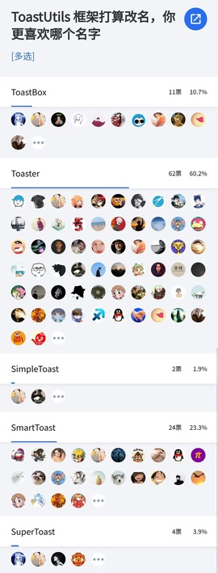

#### 目录

* [框架怎么改名了](#框架怎么改名了)

* [怎么自定义 Toast 显示动画](#怎么自定义-toast-显示动画)

* [怎么自定义 Toast 显示时长](#怎么自定义-toast-显示时长)

* [怎么自定义 Toast 布局样式](#怎么自定义-toast-布局样式)

* [怎么切换成 Toast 排队显示的策略](#怎么切换成-toast-排队显示的策略)

* [框架无法满足我当前使用的场景怎么办](#框架无法满足我当前使用的场景怎么办)

* [为什么框架优先使用 WindowManager 来实现 Toast](#为什么框架优先使用-windowManager-来实现-toast)

#### 框架怎么改名了

* 框架改名是一个重大的操作，我为什么选择在现在这个时候改，是基于以下思考：

    * 框架第一次提交是在 2018 年 9 月，不知不觉我已经维护了将近了 5 年的时间，我觉得 ToastUtils 这个名称已经配不上它的气质了，名字虽然好记，但是过于大众化，没有辨识度。

    * 虽然名称叫 ToastUtils，但是经过无数次改造和重构后，它变得不像工具类了，比如它需要先调用 init 方法来初始化框架，才能使用 show 方法来显示 Toast，另外框架还对外提供了设置 Toast 策略类、Toast 拦截器、Toast 样式类，而这些方法不应该出现一个工具类中，工具类应该是只对外提供模板方法，而不应该把外部传入的对象作为静态持有着。

    * 至于为什么选择在这个时候改名，这是框架基本稳定无 Bug 了，该解决的问题都已经解决完了，最近几个月已经没有人提 issue 了，相比前几年，一两个星期就能收到一个 issue 相比，框架已经非常稳定了，根据我以往的经验来讲，大家其实对框架的要求极其苛刻，如果这个框架在 Bugly 中有出现崩溃或者 ANR，哪怕是报一个用户一次异常，只要框架还在维护，就会有人找上门提 issue，而这次最近几个月没有人找上门，并不是用的人少了，更不是奇迹诞生了，大概率是调试阶段和线上阶段都没有找到框架的问题，框架的功能也能满足需求。

* 至于为什么改名叫 Toaster，很大一部分原因是大家的选择，我发起了一项投票，票数最多的就是这个名字，同时我也采纳了这一项，因为不仅仅是名字好记有辨识度，还具备了特殊的含义，我们都知道 Toast 中文翻译是面包的意思，而 Toaster 中文翻译是烤面包机的意思，吃 Toast 之前需要先用烤一下，口感会更加酥脆。



#### 怎么自定义 Toast 显示动画

* 在 Toast 初始化的时候，修改 Toast 策略即可

```java
Toaster.init(this, new ToastStrategy() {

    @Override
    public IToast createToast(IToastStyle<?> style) {
        if (toast instanceof CustomToast) {
            CustomToast customToast = ((CustomToast) toast);
            // 设置 Toast 动画效果
            customToast.setAnimationsId(R.anim.xxx);
        }
        return toast;
    }
});
```

* 这种方式的缺点是只有应用在前台的情况下才会生效，这是因为前台的 Toast 是用框架实现的，本质上是一个 WindowManager，优点是非常灵活，不受系统 Toast 机制限制，缺点是无法在后台的情况下显示；而后台的 Toast 是用系统来实现的，优点是能在后台的情况下显示，缺点是局限性非常大，无法做太深的定制化；而框架正是利用了两种方式的优缺点进行了互补。

#### 怎么自定义 Toast 显示时长

* 在 Toast 初始化的时候，修改 Toast 策略即可

```java
Toaster.init(this, new ToastStrategy() {

    @Override
    public IToast createToast(IToastStyle<?> style) {
        IToast toast = super.createToast(style);
        if (toast instanceof CustomToast) {
            CustomToast customToast = ((CustomToast) toast);
            // 设置短 Toast 的显示时长（默认是 2000 毫秒）
            customToast.setShortDuration(1000);
            // 设置长 Toast 的显示时长（默认是 3500 毫秒）
            customToast.setLongDuration(5000);
        }
        return toast;
    }
});
```

* 这种方式的缺点是只有应用在前台的情况下才会生效，这是因为前台的 Toast 是用框架实现的，本质上是一个 WindowManager，优点是非常灵活，不受系统 Toast 机制限制，缺点是无法在后台的情况下显示；而后台的 Toast 是用系统来实现的，优点是能在后台的情况下显示，缺点是局限性非常大，无法做太深的定制化；而框架正是利用了两种方式的优缺点进行了互补。

#### 怎么自定义 Toast 布局样式

* 如果你想设置全局的 Toast 样式，可以这样调用（选择任一一种即可）

```java
// 修改 Toast 布局
Toaster.setView(int id);
```

```java
// 修改 Toast 布局，Toast 显示重心，Toast 显示位置偏移
Toaster.setStyle(IToastStyle<?> style);
```

* 如果你想为某次 Toast 显示设置单独的样式，可以这样样用（选择任一一种即可）

```java
// 修改 Toast 布局
ToastParams params = new ToastParams();
params.text = "我是自定义布局的 Toast（局部生效）";
params.style = new CustomViewToastStyle(R.layout.toast_custom_view);
Toaster.show(params);
```

```java
// 修改 Toast 布局、Toast 显示重心、Toast 显示位置偏移
ToastParams params = new ToastParams();
params.text = "我是自定义布局的 Toast（局部生效）";
params.style = new CustomViewToastStyle(R.layout.toast_custom_view, Gravity.CENTER, 10, 20);
Toaster.show(params);
```

* 到此，大家可能有一个疑惑，为什么设置新的 Toast 样式只能传入布局 id 而不是 View 对象？因为框架每次显示 Toast 的时候，都会创建新的 Toast 对象和 View 对象，如果传入 View 对象将无法做到每次显示的时候都创建，至于框架为什么不复用这个 View 对象，这是因为如果复用了这个 View 对象，可能会触发以下异常：

```text
java.lang.IllegalStateException: View android.widget.TextView{7ffea98 V.ED..... ......ID 0,0-396,153 #102000b android:id/message} 
has already been added to the window manager.
    at android.view.WindowManagerGlobal.addView(WindowManagerGlobal.java:371)
    at android.view.WindowManagerImpl.addView(WindowManagerImpl.java:131)
    at android.widget.Toast$TN.handleShow(Toast.java:501)
    at android.widget.Toast$TN$1.handleMessage(Toast.java:403)
    at android.os.Handler.dispatchMessage(Handler.java:112)
    at android.os.Looper.loop(Looper.java:216)
    at android.app.ActivityThread.main(ActivityThread.java:7625)
    at java.lang.reflect.Method.invoke(Native Method)
    at com.android.internal.os.RuntimeInit$MethodAndArgsCaller.run(RuntimeInit.java:524)
    at com.android.internal.os.ZygoteInit.main(ZygoteInit.java:987)
```

* 这是因为 WindowManager addView 的时候成功了，但是 removeView 的时候失败了，导致下一个 Toast 显示的时候，无法复用上一个 Toast 的 View 对象，虽然这种情况比较少见，但是仍然有人跟我反馈过这个问题，为了解决这一问题，所以决定不去复用 View 对象，具体对这块的调整可以查看发版记录：[Toaster/releases/tag/9.0](https://github.com/getActivity/Toaster/releases/tag/9.0)

#### 怎么切换成 Toast 排队显示的策略

* 只需要修改 Toast 框架的初始化方式，手动传入 Toast 策略类，这里使用框架已经封装好的 ToastStrategy 类即可，

```java
// 初始化 Toast 框架
// Toaster.init(this);
Toaster.init(this, new ToastStrategy(ToastStrategy.SHOW_STRATEGY_TYPE_QUEUE));
```

* 注意构造函数需要传入 `ToastStrategy.SHOW_STRATEGY_TYPE_QUEUE`，关于这个字段的介绍可以看下面的代码注释

```java
public class ToastStrategy {

    /**
     * 即显即示模式（默认）
     *
     * 在发起多次 Toast 的显示请求情况下，显示下一个 Toast 之前
     * 会先立即取消上一个 Toast，保证当前显示 Toast 消息是最新的
     */
    public static final int SHOW_STRATEGY_TYPE_IMMEDIATELY = 0;

    /**
     * 不丢消息模式
     *
     * 在发起多次 Toast 的显示请求情况下，等待上一个 Toast 显示 1 秒或者 1.5 秒后
     * 然后再显示下一个 Toast，不按照 Toast 的显示时长来，因为那样等待时间会很长
     * 这样既能保证用户能看到每一条 Toast 消息，又能保证用户不会等得太久，速战速决
     */
    public static final int SHOW_STRATEGY_TYPE_QUEUE = 1;
}
```

#### 框架无法满足我当前使用的场景怎么办

* Toaster 框架意在解决一些的 Toast 需求，如果 Toaster 无法满足你的需求，你可以考虑使用 [XToast](https://github.com/getActivity/XToast) 悬浮窗框架来实现。

#### 为什么框架优先使用 WindowManager 来实现 Toast

* 系统 Toast 的坑太多了，主要问题表现如下：

    * 系统 Toast 会引发一些内存泄漏的问题

    * 系统 Toast 无法实现自定义显示动画、显示时长控制

    * Android 7.1 版本会主线程阻塞会出现 BadTokenException 的问题

    * Android 10.0 以下关闭通知栏权限会导致系统 Toast 显示不出来的问题

    * Android 11 及以上版本，无法自定义 Toast 样式（布局、位置重心、位置偏移）

* 所以框架优先使用 WindowManager 来代替实现 Toast 显示，具体优缺点以下：

    * 优点

        * 不会出现内存泄漏，也不会有那么多奇奇怪怪的问题

        * 可定制程度高，支持自定义动画和自定义显示时长

        * 突破 Google 在新版本 Android 对 Toast 的一些限制

    * 缺点

        *  WindowManager 无法在没有悬浮窗权限情况下在后台弹出 <br> （框架的解决方案：如果是在后台的情况下显示，则使用系统的 Toast 来显示）

       *  WindowManager 会和 Activity 绑定，会随 Activity 销毁而消失 <br> （框架的解决方案：延迟 200 毫秒显示，由此等待最新的 Activity 创建出来才调用显示，这样 WindowManager 就和最新 Activity 绑定在一起，就不会出现和旧 Activity finish 时一起消失的问题）

* 当然不是说用系统 Toast 就不好，用 WindowManger 一定就好，视具体的使用场景而定，我觉得最好的方式是：应用处于前台状态下使用 WindowManager 来显示，而处于后台状态下使用系统 Toast 来显示，两者相结合，优势互补才是最佳方案。
