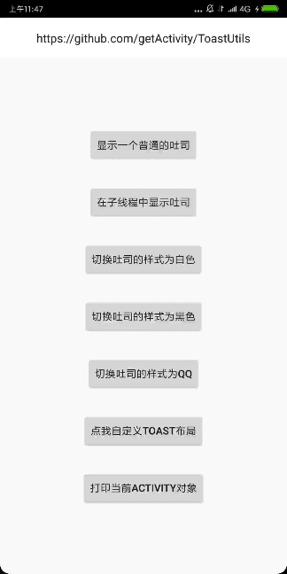
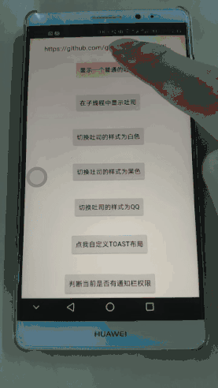
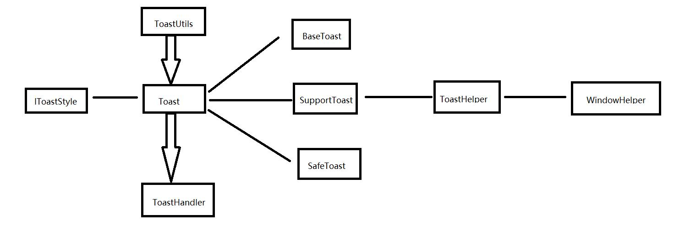

# 吐司工具类

> 码云地址：[Gitee](https://gitee.com/getActivity/ToastUtils)

> 博客地址：[只需体验三分钟，你就会跟我一样，爱上这款Toast](https://www.jianshu.com/p/9b174ee2c571)

> 已投入公司项目多时，没有任何毛病，可胜任任何需求，[点击此处下载Demo](ToastUtils.apk)

> 想了解实现原理的可以点击此链接查看：[ToastUtils](library/src/main/java/com/hjq/toast/ToastUtils.java) 源码



#### 本框架意在解决一些常见需求，如果是有一些极端的需求推荐使用 [XToast](https://github.com/getActivity/XToast)

#### 集成步骤

```groovy
dependencies {
    implementation 'com.hjq:toast:8.8'
}
```

#### 初始化 Toast

```java
// 在 Application 中初始化
ToastUtils.init(this);
```

#### 显示 Toast

```java
ToastUtils.show("我是吐司");
```

#### 其他 API

```java
// 设置Toast布局
ToastUtils.setView();

// 设置吐司重心
ToastUtils.setGravity();

// 获取Toast对象
ToastUtils.getToast();
```

#### 自定义Toast样式

> 如果对Toast的默认样式不满意，可以在Application初始化样式，具体可参考[ToastBlackStyle](library/src/main/java/com/hjq/toast/style/ToastBlackStyle.java)类的实现

```java
ToastUtils.initStyle(new IToastStyle());
```

#### 框架亮点

* 无需权限：不管有没有授予通知栏权限都不影响吐司的弹出

* 兼容性强：处理原生 Toast 在 Android 7.1 产生崩溃的历史遗留问题

* 功能强大：不分主次线程都可以弹出Toast，自动区分资源 id 和 int 类型

* 使用简单：只需传入文本，会自动根据文本长度决定吐司显示的时长

* 性能最佳：单例吐司，整个 Toast 只有一个 TextView，并且通过代码创建

* 体验最优：限制 Toast 短时间内弹出的次数，避免频繁弹出造成不良的用户体验

* 支持多种样式：默认为黑色样式，夜间模式可使用白色样式，还有仿 QQ 吐司样式

* 支持自定义样式：吐司（背景、圆角、重心、偏移），文字（大小、颜色、边距）

* 支持自定义扩展：支持获取 ToastUtils 中的 Toast 对象，支持重新自定义 Toast 布局

* 支持全局配置样式：可以在 Application 中初始化 Toast 样式，达到一劳永逸的效果

* 已适配 Android R：Android 11 之后不能弹出自定义样式的 Toast，框架针对这种情况进行了适配

#### 关于通知栏权限

> 本框架已经完美解决这个问题（禁用通知栏权限后需要重启应用、重启应用、重启应用才能后生效，请以[Demo](https://raw.githubusercontent.com/getActivity/ToastUtils/master/ToastUtils.apk)测试为主）

> 在开启 APP 的同时关闭通知栏权限的情况极少（测试人员才会这么做），所以仅在 Application 初始化的时候才对没有通知栏权限的情况进行判断和兼容

> 具体解决方案可见：[Toast通知栏权限填坑指南](https://www.jianshu.com/p/1d64a5ccbc7c)




#### ToastUtils 架构图



#### 如何替换项目中已有的 Toast ？

> 右击项目，Replace in path，勾选 Regex 选项

```java
Toast\.makeText\([^,]+,\s*(.+{1}),\s*[^,]+\)\.show\(\)
```

> 替换使用

```java
ToastUtils.show($1)
```

> 包名替换

```java
import android.widget.Toast
```

---

```java
import com.hjq.toast.ToastUtils
```

>  再全局搜索，手动更换一些没有替换成功的

```java
Toast.makeText
```

#### 作者的其他开源项目

* 安卓架构：[AndroidProject](https://github.com/getActivity/AndroidProject)

* 网络框架：[EasyHttp](https://github.com/getActivity/EasyHttp)

* 日志框架：[Logcat](https://github.com/getActivity/Logcat)

* 权限框架：[XXPermissions](https://github.com/getActivity/XXPermissions)

* 标题栏框架：[TitleBar](https://github.com/getActivity/TitleBar)

* 国际化框架：[MultiLanguages](https://github.com/getActivity/MultiLanguages)

* 悬浮窗框架：[XToast](https://github.com/getActivity/XToast)

#### Android技术讨论Q群：78797078

#### 如果您觉得我的开源库帮你节省了大量的开发时间，请扫描下方的二维码随意打赏，要是能打赏个 10.24 :monkey_face:就太:thumbsup:了。您的支持将鼓励我继续创作:octocat:

 

#### [点击查看捐赠列表](https://github.com/getActivity/Donate)

## License

```text
Copyright 2018 Huang JinQun

Licensed under the Apache License, Version 2.0 (the "License");
you may not use this file except in compliance with the License.
You may obtain a copy of the License at

   http://www.apache.org/licenses/LICENSE-2.0

Unless required by applicable law or agreed to in writing, software
distributed under the License is distributed on an "AS IS" BASIS,
WITHOUT WARRANTIES OR CONDITIONS OF ANY KIND, either express or implied.
See the License for the specific language governing permissions and
limitations under the License.
```
