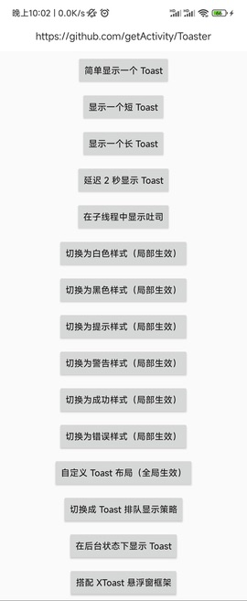
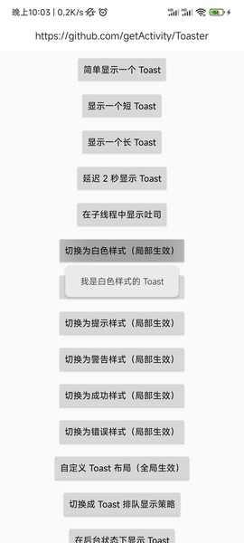
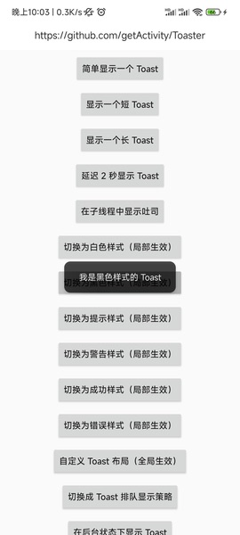
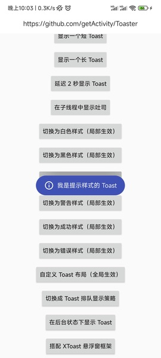
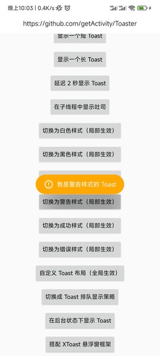
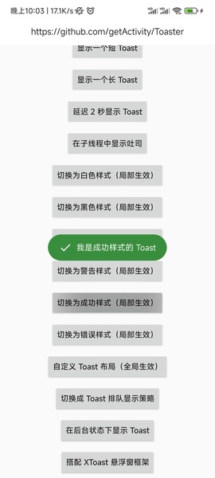
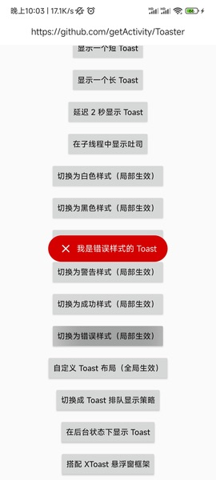
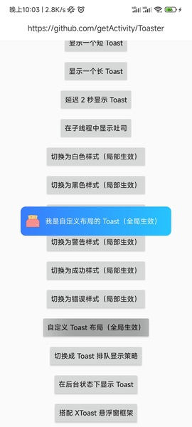
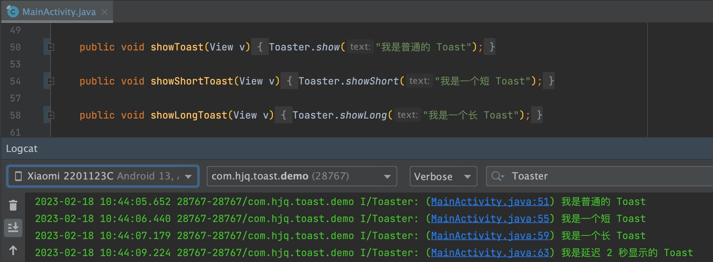

# [English Doc](README-en.md)

# 吐司框架

* 项目地址：[Github](https://github.com/getActivity/Toaster)

* 博客地址：[只需体验三分钟，你就会跟我一样，爱上这款 Toast](https://www.jianshu.com/p/9b174ee2c571)

* 可以扫码下载 Demo 进行演示或者测试，如果扫码下载不了的，[点击此处可直接下载](https://github.com/getActivity/Toaster/releases/download/12.5/Toaster.apk)


  

  

 

#### 集成步骤

* 如果你的项目 Gradle 配置是在 `7.0 以下`，需要在 `build.gradle` 文件中加入

```groovy
allprojects {
    repositories {
        // JitPack 远程仓库：https://jitpack.io
        maven { url 'https://jitpack.io' }
    }
}
```

* 如果你的 Gradle 配置是 `7.0 及以上`，则需要在 `settings.gradle` 文件中加入

```groovy
dependencyResolutionManagement {
    repositories {
        // JitPack 远程仓库：https://jitpack.io
        maven { url 'https://jitpack.io' }
    }
}
```

* 配置完远程仓库后，在项目 app 模块下的 `build.gradle` 文件中加入远程依赖

```groovy
android {
    // 支持 JDK 1.8
    compileOptions {
        targetCompatibility JavaVersion.VERSION_1_8
        sourceCompatibility JavaVersion.VERSION_1_8
    }
}

dependencies {
    // 吐司框架：https://github.com/getActivity/Toaster
    implementation 'com.github.getActivity:Toaster:12.5'
}
```

#### 初始化框架

```java
public class XxxApplication extends Application {

    @Override
    public void onCreate() {
        super.onCreate();

        // 初始化 Toast 框架
        Toaster.init(this);
    }
}
```

#### 框架 API 介绍

```java
// 显示 Toast
Toaster.show(CharSequence text);
Toaster.show(int id);
Toaster.show(Object object);

// debug 模式下显示 Toast
Toaster.debugShow(CharSequence text);
Toaster.debugShow(int id);
Toaster.debugShow(Object object);

// 延迟显示 Toast
Toaster.delayedShow(CharSequence text, long delayMillis);
Toaster.delayedShow(int id, long delayMillis);
Toaster.delayedShow(Object object, long delayMillis);

// 显示短 Toast
Toaster.showShort(CharSequence text);
Toaster.showShort(int id);
Toaster.showShort(Object object);

// 显示长 Toast
Toaster.showLong(CharSequence text);
Toaster.showLong(int id);
Toaster.showLong(Object object);

// 自定义显示 Toast
Toaster.show(ToastParams params);

// 取消 Toast
Toaster.cancel();

// 设置 Toast 布局（全局生效）
Toaster.setView(int id);

// 设置 Toast 样式（全局生效）
Toaster.setStyle(IToastStyle<?> style);
// 获取 Toast 样式
Toaster.getStyle()

// 判断当前框架是否已经初始化
Toaster.isInit();

// 设置 Toast 策略（全局生效）
Toaster.setStrategy(IToastStrategy strategy);
// 获取 Toast 策略
Toaster.getStrategy();

// 设置 Toast 重心和偏移
Toaster.setGravity(int gravity);
Toaster.setGravity(int gravity, int xOffset, int yOffset);

// 设置 Toast 拦截器（全局生效）
Toaster.setInterceptor(IToastInterceptor interceptor);
// 获取 Toast 拦截器
Toaster.getInterceptor();
```

#### 框架混淆规则

* 在混淆规则文件 `proguard-rules.pro` 中加入

```text
-keep class com.hjq.toast.** {*;}
```

## [常见疑问请点击此处查看](HelpDoc-zh.md)

#### 不同 Toast 框架之间的对比

|  功能或细节  | [Toaster](https://github.com/getActivity/Toaster) | [AndroidUtilCode-ToastUtils](https://github.com/Blankj/AndroidUtilCode)  | [Toasty](https://github.com/GrenderG/Toasty) |
| :----: | :------: |  :-----: |  :-----: |
|    对应版本  |  12.5 |  1.30.6  |  1.5.0  |
|    issues 数   |  [](https://github.com/getActivity/Toaster/issues)  |  [](https://github.com/Blankj/AndroidUtilCode/issues)  |  [](https://github.com/GrenderG/Toasty/issues)  |
|                    框架体积                 | 32 KB | 500 KB | 50 KB |
|                   框架维护状态               | 维护中 | 停止维护 | 停止维护 |
|                  调用代码定位                |  ✅  |  ❌  |  ❌  |
|              支持在子线程中调用显示            |  ✅  |  ✅  |  ❌  |
|            支持设置局部 Toast 样式            |  ✅  |  ❌  |  ❌  |
|            支持设置全局 Toast 样式            |  ✅  |  ❌  |  ❌  |
|              支持 Toast 即显即示             |  ✅  |  ✅  |  ❌  |
|              支持 Toast 排队显示             |  ✅  |  ❌  |  ✅  |
|              支持 Toast 延迟显示             |  ✅  |  ❌  |  ❌  |
|      处理 Toast 在 Android 7.1 崩溃的问题     |  ✅  |  ✅  |  ❌  |
|    兼容通知栏权限关闭后 Toast 显示不出来的问题    |  ✅  |  ✅  |  ❌  |
|   适配 Android 11 不能在后台显示 Toast 的问题   |  ✅  |  ❌  |  ❌  |

#### 调用代码定位功能介绍

* 框架会在日志打印中输出在 Toast 调用的代码位置，这样开发者可以直接通过点击 Log 来定位是在哪个类哪行代码调用的，这样可以极大提升我们排查问题的效率，特别是 Toast 的内容是由服务器返回的情况下，我相信没有任何一个人会拒绝这样的功能。



#### Toast 在 Android 7.1 崩溃的问题介绍

> [Toast 在 Android 7.1 崩溃排查及修复](https://www.jianshu.com/p/437f473017d6)

* 这个问题是由于 Android 7.1 加入 WindowToken 校验机制导致的，而这个 WindowToken 是 NotificationManagerService 生成的，这个 WindowToken 是存在一定时效性的，而当应用的主线程被阻塞时，WindowManager 在 addView 时会对 WindowToken 进行校验，但是 WindowToken 已经过期了，这个时候 addView 就会抛出异常。

* 谷歌在 Android 8.0 就修复了这个问题，修复方式十分简单粗暴，就是直接捕获这个异常，而框架的修复思路跟谷歌类似，只不过修复方式不太一样，因为框架无法直接修改系统源码，所以是直接通过 Hook 的方式对异常进行捕获。

#### 通知栏权限关闭后 Toast 显示不出来的问题介绍

> [Toast通知栏权限填坑指南](https://www.jianshu.com/p/1d64a5ccbc7c)

* 这个问题的出现是因为原生 Toast 的显示要通过 NMS（NotificationManagerService） 才会 addView 到 Window 上面，而在 NMS 中有一个 `static final boolean ENABLE_BLOCKED_TOASTS = true` 的字段，当这个常量值为 true 时，会触发 NMS 对应用通知栏权限的检查，如果没有通知栏权限，那么这个 Toast 将会被 NMS 所拦截，并输出 `Suppressing toast from package` 日志信息，而小米手机没有这个问题是因为它是将 `ENABLE_BLOCKED_TOASTS` 字段值修改成 `false`，所以就不会触发对通知栏权限的检查，另外我为什么会知道有这个事情？因为我曾经和一名 MIUI 工程师一起确认过这个事情。

* 框架处理这个问题的方式有两种，先判断当前应用是否处于前台状态，如果是则使用自定义的 WindowManager 代替 Toast 来显示，如果当前应用处于后台状态，则会通过 Hook Toast 中的 INotificationManager 接口，将 enqueueToast 方法传递的包名参数修改成 `android` 来欺骗 NotificationManagerService，因为 NotificationManagerService 已经将 `android` 包名的应用纳入白名单，系统会自动放行，需要注意的是，这种方式在 Android 10 上面已经失效了，已经被系统纳入反射黑名单，但是好消息是，通过查看和对比 NotificationManagerService 源码发现，这个问题（关闭通知栏权限后无法在前台弹 Toast 的问题）已经在 Android 10.0 的版本上面被修复了，所以框架只在 Android 9.0 及以下版本并且在关闭了通知栏权限的情况下才去 Hook INotificationManager，另外我还找到了官方关于这块的代码提交记录：[Always allow toasts from foreground apps](https://cs.android.com/android/_/android/platform/frameworks/base/+/58b2453ed69197d765c7254241d9966ee49a3efb)，大家可以感兴趣可以看看，还有一个问题，如果你想在 Android 10 及之后的版本仍然能在后台显示 Toast，请保证应用的通知栏权限或者悬浮窗权限处于开启的状态，如果你一定要求在后台状态下要 100% 能显示 Toast，请保证应用有悬浮窗权限，因为在某些厂商的手机上，就算有通知栏权限也是无法在后台显示 Toast，例如我用 HarmonyOS 2.0 测试就不行，所以具体要看产品怎么斟酌。

#### Android 11 不能在后台显示 Toast 的问题介绍

* 当我们将 targetSdkVersion 改成 30 及以上的版本时，会发现一个问题，如果应用处于后台进程的情况下，而恰好我们的应用 Toast 样式是经过定制的，那么在这些情况下调用 Toast 的 show 方法会惊奇的发现，Toast 没有显示出来，请注意这个问题不是 Bug，而是 Android 11 禁止了这种行为，在 [Toast 官方文档](https://developer.android.google.cn/reference/android/widget/Toast#setView(android.view.View)) 中也有注明，不建议对 Toast 的样式做定制化，并且还对 `Toast.setView` 方法进行了标记过时处理。

* 那么我们如何解决这一问题呢？难道真的不能用自定义样式的 Toast 了？我的答案是：不，凡事不能一刀切，谷歌只说不能在后台显示自定义的 Toast，并不能代表不能在前台那么做，框架的适配思路是，在 Android 11 的情况下，会先判断当前应用是处于前台还是后台，如果是在前台的情况下就显示自定义样式的 Toast，如果是在后台的情况下就显示系统样式的 Toast（通过舍弃自定义样式来保证 Toast 能够正常显示出来），这样既能符合 Android 11 要求，同时又能将定制化 Toast 的权益最大化。

* 值得注意的是：Toaster 是目前同类框架第一款也是唯一一款适配 Android 11 这一特性的框架。

#### 框架亮点

* 一马当先：首款适配 Android 11 的吐司框架，开发者无需关心适配过程

* 无需权限：[不管有没有授予通知栏权限都不影响吐司的弹出](https://www.jianshu.com/p/1d64a5ccbc7c)

* 兼容性强：[处理原生 Toast 在 Android 7.1 产生崩溃的历史遗留问题](https://www.jianshu.com/p/437f473017d6)

* 功能强大：不分主次线程都可以弹出Toast，自动识别资源 id 和 int 类型

* 使用简单：只需传入文本，会自动根据文本长度决定吐司显示的时长

* 性能最佳：使用懒加载模式，只在显示时创建 Toast，不占用 Application 启动时间

* 体验最佳：显示下一个 Toast 会取消上一个 Toast 的显示，真正做到即显即示

* 全局统一：可以在 Application 中初始化 Toast 样式，达到一劳永逸的效果

#### 如何替换项目中已有的原生 Toast

* 在项目中右击弹出菜单，Replace in path，勾选 Regex 选项，点击替换

```text
Toast\.makeText\([^,]+,\s*(.+),\s*[^,]+\)\.show\(\)
```

```text
Toaster.show($1)
```

* 对导包进行替换

```text
import android.widget.Toast
```

```text
import com.hjq.toast.Toaster
```

*  再全局搜索，手动更换一些没有替换成功的

```text
Toast.makeText
new Toast
```

#### 作者的其他开源项目

* 安卓技术中台：[AndroidProject](https://github.com/getActivity/AndroidProject)  

* 安卓技术中台 Kt 版：[AndroidProject-Kotlin](https://github.com/getActivity/AndroidProject-Kotlin)  

* 权限框架：[XXPermissions](https://github.com/getActivity/XXPermissions)  

* 网络框架：[EasyHttp](https://github.com/getActivity/EasyHttp)  

* 标题栏框架：[TitleBar](https://github.com/getActivity/TitleBar)  

* 悬浮窗框架：[EasyWindow](https://github.com/getActivity/EasyWindow)  

* ShapeView 框架：[ShapeView](https://github.com/getActivity/ShapeView)  

* ShapeDrawable 框架：[ShapeDrawable](https://github.com/getActivity/ShapeDrawable)  

* 语种切换框架：[MultiLanguages](https://github.com/getActivity/MultiLanguages)  

* Gson 解析容错：[GsonFactory](https://github.com/getActivity/GsonFactory)  

* 日志查看框架：[Logcat](https://github.com/getActivity/Logcat)  

* 嵌套滚动布局框架：[NestedScrollLayout](https://github.com/getActivity/NestedScrollLayout)  

* Android 版本适配：[AndroidVersionAdapter](https://github.com/getActivity/AndroidVersionAdapter)  

* Android 代码规范：[AndroidCodeStandard](https://github.com/getActivity/AndroidCodeStandard)  

* Android 资源大汇总：[AndroidIndex](https://github.com/getActivity/AndroidIndex)  

* Android 开源排行榜：[AndroidGithubBoss](https://github.com/getActivity/AndroidGithubBoss)  

* Studio 精品插件：[StudioPlugins](https://github.com/getActivity/StudioPlugins)  

* 表情包大集合：[EmojiPackage](https://github.com/getActivity/EmojiPackage)  

* AI 资源大汇总：[AiIndex](https://github.com/getActivity/AiIndex)  

* 省市区 Json 数据：[ProvinceJson](https://github.com/getActivity/ProvinceJson)  

* Markdown 语法文档：[MarkdownDoc](https://github.com/getActivity/MarkdownDoc)  

#### 微信公众号：Android轮子哥


#### Android 技术 Q 群：10047167

#### 如果您觉得我的开源库帮你节省了大量的开发时间，请扫描下方的二维码随意打赏，要是能打赏个 10.24 :monkey_face:就太:thumbsup:了。您的支持将鼓励我继续创作:octocat:（[点击查看捐赠列表](https://github.com/getActivity/Donate)）

 

#### 广告区

* 我现在任腾讯云服务器推广大使，大家如果有购买服务器的需求，可以通过下面的链接购买

[](https://curl.qcloud.com/A6cYskvv)

[【腾讯云】云服务器、云数据库、COS、CDN、短信等云产品特惠热卖中](https://curl.qcloud.com/A6cYskvv)

[](https://curl.qcloud.com/up4fQsdn)

[【腾讯云】中小企业福利专场，多款刚需产品，满足企业通用场景需求](https://curl.qcloud.com/up4fQsdn)

## License

```text
Copyright 2018 Huang JinQun

Licensed under the Apache License, Version 2.0 (the "License");
you may not use this file except in compliance with the License.
You may obtain a copy of the License at

   http://www.apache.org/licenses/LICENSE-2.0

Unless required by applicable law or agreed to in writing, software
distributed under the License is distributed on an "AS IS" BASIS,
WITHOUT WARRANTIES OR CONDITIONS OF ANY KIND, either express or implied.
See the License for the specific language governing permissions and
limitations under the License.
```